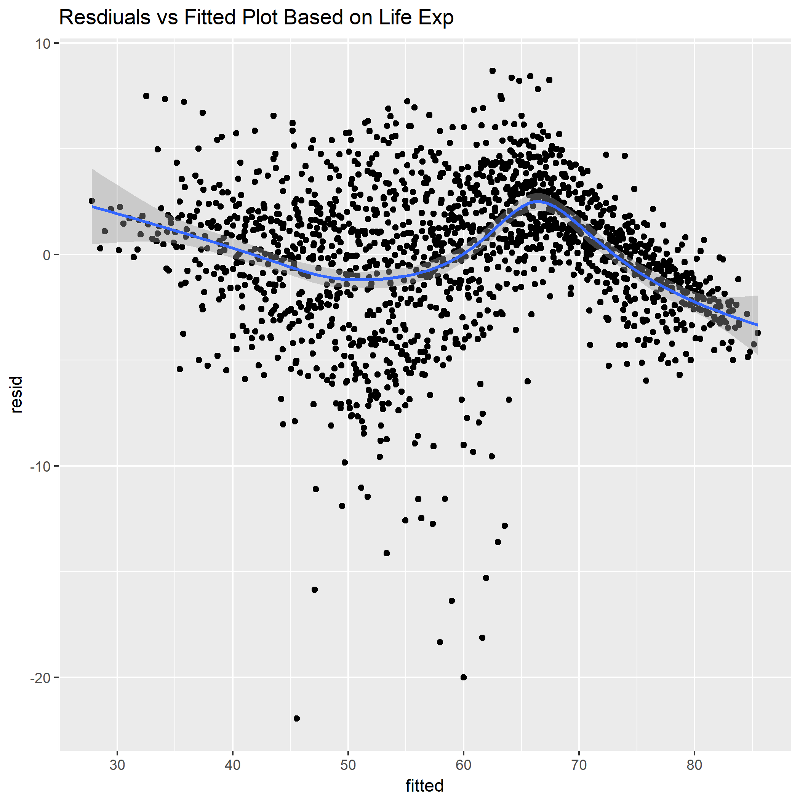

```{r load-data}
data <- read.csv("hw7.csv")
```

Based on the graph, it indicated non-linearity in the model. This suggests changes in the structural form of the model. 

Below is the table of residuals vs fitted values of Life Expectancy across countries:

```{r analyze-data}
library(knitr)
k <- kable(data, caption = "Residuals vs Fitted Table")
k
```

