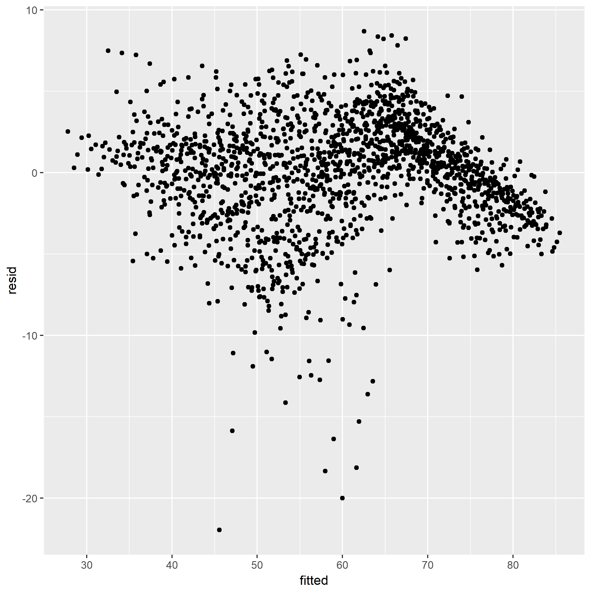

```{r load-data}
data <- read.csv("hw7.csv")
```

Based on the graph, it indicated non-linearity in the model. This suggests changes in the structural form of the model. 

Below is the table of residuals vs fitted values (the first 10 columns) of every country:

```{r analyze-data}
table <- head(as.data.frame(data), n=10)
table
```

